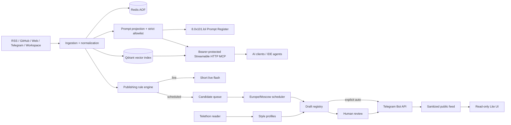

# Architecture

## Trust boundaries
 
- Administrative APIs and `/studio` use HTTP Basic authentication.
- Prompt-only hosts (`8.0x101.lol`, `08.0x101.lol`) expose `/prompts`, `/lite`, `/health`, `/api/prompts/*`, `/api/daily-pass/*`, `/api/public/*`, `/mcp` (Bearer token) and `/studio` (HTTP Basic Auth); internal Radar/OSINT dashboard and raw ingestion APIs are rejected with `404 Prompt-only surface`.
- `/mcp` requires a separate Bearer token and exposes only read-only tools backed by the public prompt allowlist.
- MCP transport validates `Host` and `Origin` against explicit production allowlists to prevent DNS rebinding.
- `/api/public/*` and `/lite` are intentionally public and return an allowlisted schema only.
- Telegram Bot API publishes; Telethon reads monitored/style channels.
- A live rule with an unavailable AI predicate fails closed and creates a review draft.
- Idempotency keys prevent repeated publication for 30 days.

## Persistence

Channels, styles, rules, drafts and public posts are Redis hashes. Scheduled drafts and candidates are sorted sets. The audit trail is a capped Redis stream. Redis AOF and the Qdrant volume survive container restarts.
