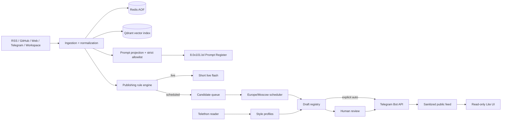

# Architecture

## Trust boundaries

- Administrative APIs and `/studio` use HTTP Basic authentication.
- Prompt-only host middleware exposes only `/prompts`, `/api/prompts` and `/health`; workspace and Telegram records are rejected before projection.
- `/api/public/*` and `/lite` are intentionally public and return an allowlisted schema only.
- Telegram Bot API publishes; Telethon reads monitored/style channels.
- A live rule with an unavailable AI predicate fails closed and creates a review draft.
- Idempotency keys prevent repeated publication for 30 days.

## Persistence

Channels, styles, rules, drafts and public posts are Redis hashes. Scheduled drafts and candidates are sorted sets. The audit trail is a capped Redis stream. Redis AOF and the Qdrant volume survive container restarts.
